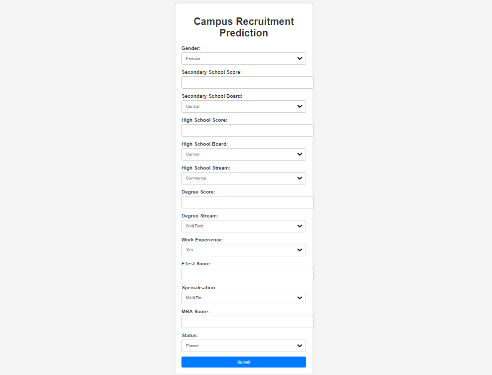

# Campus Recruitment Prediction Project

This project aims to predict the salary of students in campus recruitment using a dataset named `train.csv`. The dataset contains the following columns: sl_no, gender, ssc_p, ssc_b, hsc_p, hsc_b, degree_p, degree_t, workex, etest_p, specialisation, mba_p, status, and salary.

## Table of Contents
- [Introduction](#introduction)
- [Project Structure](#project-structure)
- [Data Processing and Modeling](#data-processing-and-modeling)
- [Flask Web Application](#flask-web-application)

## Introduction
In this project, we analyze the provided dataset and build a predictive model for campus recruitment. We first perform data processing and exploratory data analysis (EDA) using a Jupyter Notebook (`notebook.ipynb`). Next, we implement a Flask web application (`app.py`) to deploy the trained predictive model and allow users to make predictions based on the provided input.

## Project Structure
- `train.csv`: Dataset containing recruitment-related information.
- `notebook.ipynb`: Jupyter Notebook containing data preprocessing, EDA, and model selection.
- `app.py`: Flask web application for model deployment.
- `templates/`: Directory containing HTML templates for the web application.
  - `index.html`: Homepage of the web application.
  - `prediction.html`: Page displaying predictions.
- `requirements.txt`: File listing all the necessary libraries for running the web app.
- `model.pkl`: Pickled file containing the trained predictive model (Ridge model).
- `scaler.pkl`: Pickled file containing the scaler used for standardization.

## Data Processing and Modeling
In the Jupyter Notebook (`notebook.ipynb`), we perform the following steps:
1. Import necessary libraries.
2. Load the dataset (`train.csv`).
3. Preprocess the data by dropping unnecessary columns and handling missing values.
4. Visualize data through various plots and charts.
5. Perform one-hot encoding for categorical variables.
6. Split the dataset into training and testing sets.
7. Standardize the data using StandardScaler.
8. Explore and select the best scoring model using GridSearchCV and ShuffleSplit.
9. Save the best-fitted model and scaler using pickle (`model.pkl` and `scaler.pkl`).

## Flask Web Application
The Flask web application (`app.py`) is created to deploy the trained predictive model. It allows users to input their information and receive predictions regarding their placement status and expected salary. The web application consists of two main HTML templates:
- `index.html`: The homepage where users input their details.
- `prediction.html`: The page displaying the predicted placement status and salary.

To run the web application, use the libraries specified in `requirements.txt`.

For any questions or suggestions, please feel free to contact me on LinkedIn.

## Webpage Glimpse:

